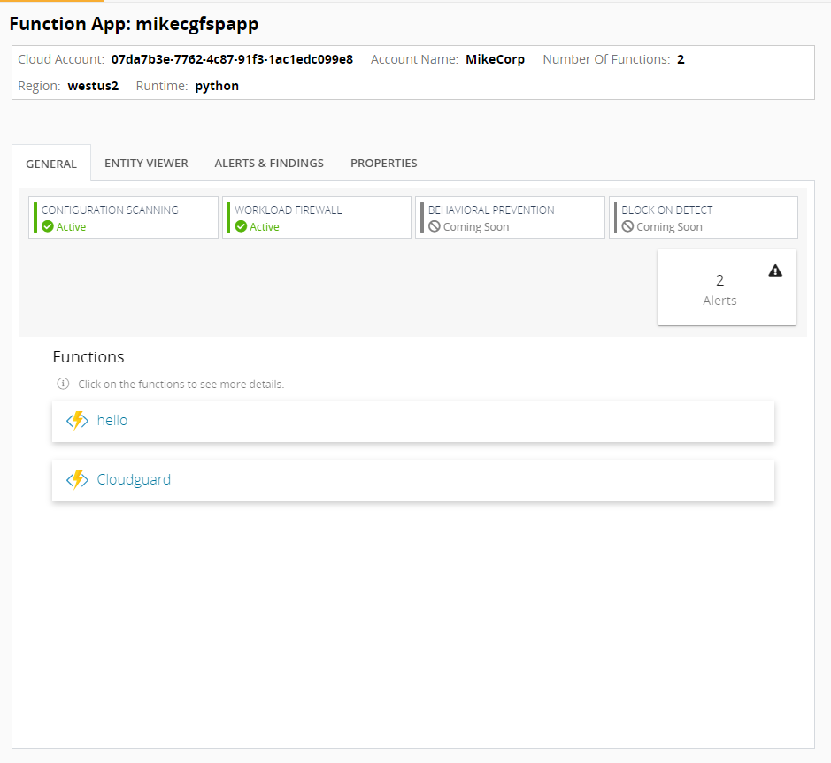
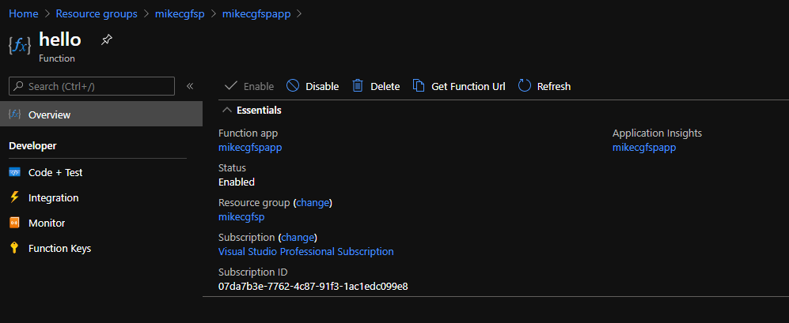
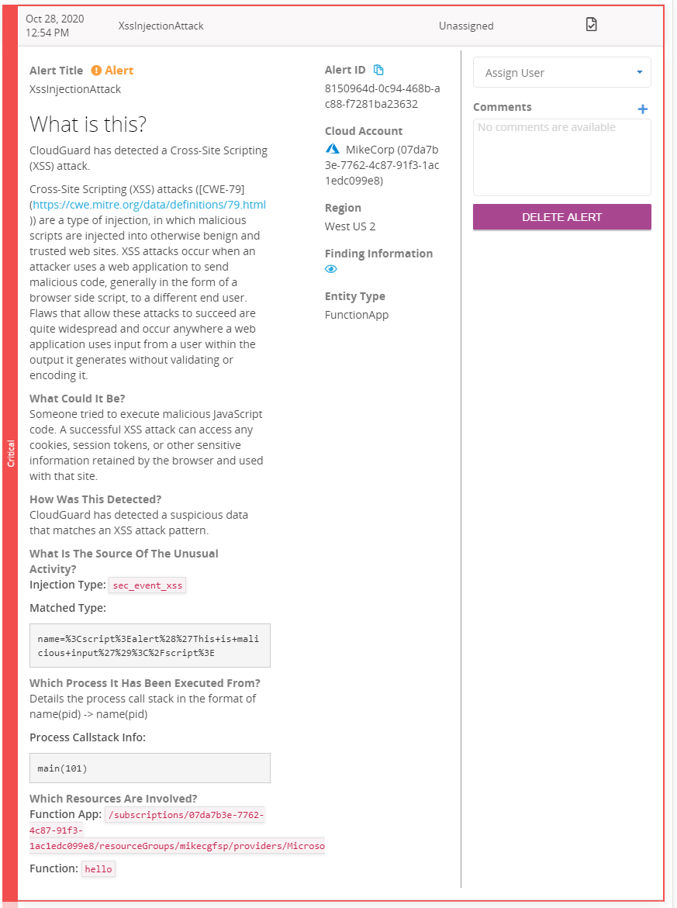

# Cloudguard Workload and Azure Functions


<p align="left">
    
</p>    

This document outlines how to apply Cloudguard Workload protection to an Azure Function in a CI/CD pipeline. The feature being installed is call FSP or Function Self Protect. This is for demonstration purposes only. Here is a logical diagram of the Azure Function: <br>


This function is deployed through Github Actions. That being said, it can be deployed using any CI/CD tool. All of the instructions for the CI/CD pipeline are stored in the [build.yml](.github/actions/build.yml). From a high level this is what the build pipeline does: <br><br>

1. Configure Runner Environment <br>
2. Set up Azure Resource Group, Storage Container and Function App <br>
3. Apply Cloudguard FSP (Function Self Protect <br>


<b> Get started by forking this repository! </b>

## Prerequisites

In order to run this demo, you need the following:

[Github Account](https://github.com) <br>
[Azure Account](https://portal.azure.com) <br>
[Check Point Cloud Security Posture Management Account](https://secure.dome9.com/) <br>

<br>
To run the activity.py script, you must also have Python3.

## Setup

Ensur Azure Serverless Protection is enabled on [Check Point Cloud Security Posture Management ](https://secure.dome9.com/) <br><br>


### Microsoft Azure

Create an App Registration in Azure. As this will be used multiple times, please note the following:

- Application (client) ID <br>
- Directory (tenant) ID <br>
- Secret <br>
- Subscription ID <br>

Ensure that you give this app registration "Contributor" permission. 

## Prep the Github Environment

First go to Settings > Secrets and populate the secrets: <br>

<br>

CG_TOKEN - <b>Note: This must be in the format DOME9_API_KEY:DOME_API_SECRET</b> <br>      AZURE_SUBSCRIPTION_ID <br>
AZURE_TENANT_ID <br>
AZURE_CLIENT_ID <br>
AZURE_CLIENT_SECRET <br>
AZ_RG -  This is the name of the resource group to be created <br> 
AZ_LOCATION - Azure Region. EG: West US 2 <br>
STORAGE_NAME - Name of your storage container <br>
APP_NAME - App name. <b>This must be unique</b> <br><br>

<b>Note: Standard naming for Azure rules apply.</b><br><br>

Second, select the "Actions" tab and enable workflows.

## Run the Build

To deploy this function to Azure, modify the _build_flag and commit the changes. This kicks off the Github Action pipeline. Once the build is finished, you will then see it in Check Point CSPM<br>


### Sync to Check Point CSPM

Depending on when you build your function in relation to the sync interval it may take some time for the information to appear. If you would like to force this synchronization, you can run the following command: <br><br>

```
curl -X POST https://api.dome9.com/v2/AzureCloudAccount/<CLOUDGUARD_ID_FOR_AZURE>/SyncNow --basic -u <DOME9_API_KEY>:<DOME_SECRET> -H 'Accept: application/json'
```

## Check Point CSPM

Open Check Point CSPM and navigate to the "Serverless" option. Select "Serverless Assets" and click on the function you created. This is what you will see: <br><br>


## Testing the function

First, grab the URL of your function. <br><br>



To test the function, navigate back to the /scripts directory and run activity.py.

```
λ python scripts\activity.py
Target: <APP URL>
Select 1 for Bening Input and 2 for Malicious Input: 1
b'Hello, Cloudguard Workload. This HTTP triggered function executed successfully.'

```


### Malicious Input

You can also test putting in malicious input. Here is an example:

```
λ python scripts\activity.py
Target: <APP URL>
Select 1 for Bening Input and 2 for Malicious Input: 2
b'This HTTP triggered function executed successfully. Pass a name in the query string or in the request body for a personalized response.'
```



At this point, since this product is still in EA, it only has detection capabilities. Blocking capabilities are comming soon!


## Cleanup

To delete the environment, modify the _destroy_flag and commit the changes. This will delete everything that was created.