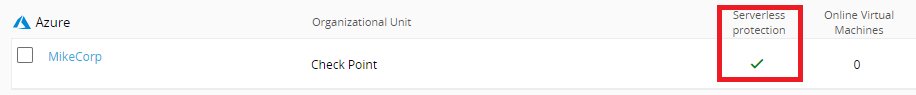
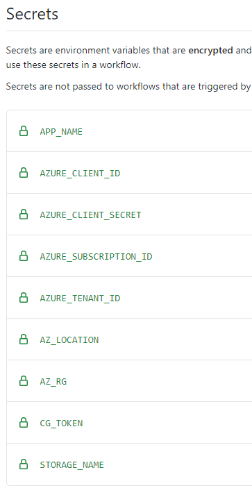
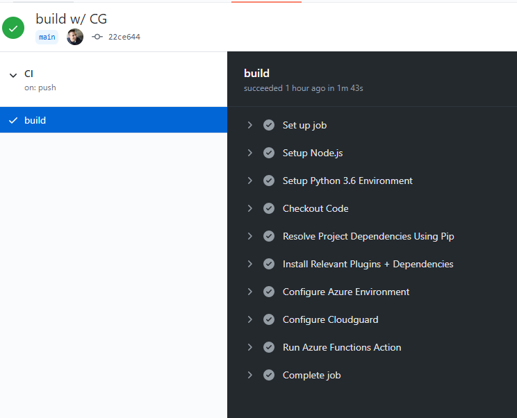

# Cloudguard Workload and Azure Functions

    

    

This document outlines how to apply Cloudguard Workload protection to an Azure Function in a CI/CD pipeline. The feature being installed is call FSP or Function Self Protect. This is for demonstration purposes only. Here is a logical diagram of the Azure Function:  

This function is deployed through Github Actions. That being said, it can be deployed using and CI/CD tool. All of the instructions for the CI/CD pipeline are stored in the [build.yml](.github/actions/build.yml). From a high level this is what the build pipeline does:   

1. Configure Runner Environment  
2. Set up Azure Resource Group, Storage Container and Function App  
3. Apply Cloudguard FSP (Function Self Protect  

<b> Get started by forking this repository! </b>

## Prerequisites

In order to run this demo, you need the following:

[Github Account](https://github.com)  
[Azure Account](https://portal.azure.com)  
[Check Point Cloud Security Posture Management Account](https://secure.dome9.com/)  

 
To run the activity.py script, you must also have Python3.

## Setup

Ensur Azure Serverless Protection is enabled on [Check Point Cloud Security Posture Management ](https://secure.dome9.com/)   

### Microsoft Azure

Create an App Registration in Azure. As this will be used multiple times, please note the following:

- Application (client) ID  
- Directory (tenant) ID  
- Secret  
- Subscription ID  

Ensure that you give this app registration "Contributor" permission. This is required for Terraform to build the environment.

## Prep the Github Environment

First go to Settings > Secrets and populate the secrets:  

 

CG_TOKEN - <b>Note: This must be in the format DOME9_API_KEY:DOME_API_SECRET</b>        AZURE_SUBSCRIPTION_ID  
AZURE_TENANT_ID  
AZURE_CLIENT_ID  
AZURE_CLIENT_SECRET  
AZ_RG -  This is the name of the resource group to be created   
AZ_LOCATION - Azure Region. EG: West US 2  
STORAGE_NAME - Name of your storage container  
APP_NAME - App name. <b>This must be unique</b>   

<b>Note: Standard naming for Azure rules apply.</b>  

Second, select the "Actions" tab and enable workflows.

## Run the Build

To deploy this function to Azure, modify the _build_flag and commit the changes. This kicks off the Github Action which deploys the function. Once the build is finished, you will then see it in Check Point CSPM 

